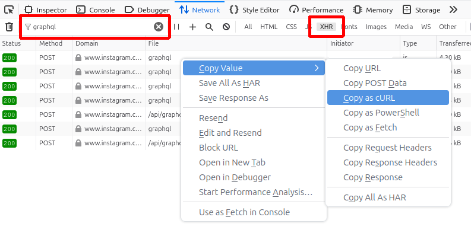

# Authentication
You may want to use [mautrix-manager](https://github.com/mautrix/manager)
instead of bot commands. It will automate extracting cookies so you don't need
to mess with browser devtools.

0. Open a private chat with the bridge bot. Usually `@instagrambot:your.server` or `@facebookbot:your.server`
   * If the bot doesn't accept the invite, see the [troubleshooting page](../../general/troubleshooting.md)
1. Send `login` to the bridge bot. The bot should ask you to paste cookies,
   which will happen in step 6.
2. Open the website in a private window (facebook.com, messenger.com or
   instagram.com, depending on what you configured the bridge to use).
3. Open browser devtools and go to the network tab.
   Select "XHR" as the request type and search for `graphql`.
4. Log in normally.
5. Right click one of the requests in devtools,
   choose "Copy" (Chrome) or "Copy Value" (Firefox), then "Copy as cURL".
   * Any request with the correct cookies should work, graphql is just used
     as an example that should be easy to find.
   * Note for windows users: Make sure to select "Copy as cURL (POSIX)",
     not "(Windows)", if given both options.
   * You can also find the cookies manually and send them to the bot as a
     simple key-value JSON object. The relevant cookies are:
     * Instagram: `sessionid`, `csrftoken`, `mid`, `ig_did`, `ds_user_id`
     * Facebook: `datr`, `c_user`, `sb`, `xs`
6. Paste the copied data to the bridge bot.
7. The bot should inform you of a successful login and sync recent chats.

**N.B.** In some cases, Meta may decide your account has suspicious activity
and block you until you do some tasks like completing a captcha, adding a phone
number or resetting your password. It is recommended to have two-factor
authentication enabled to reduce the risk of such blocks.

